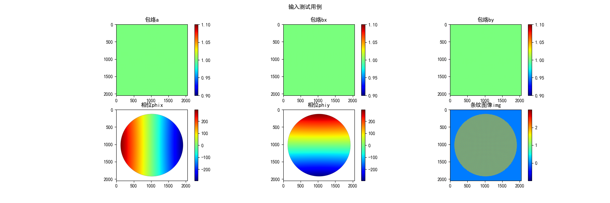
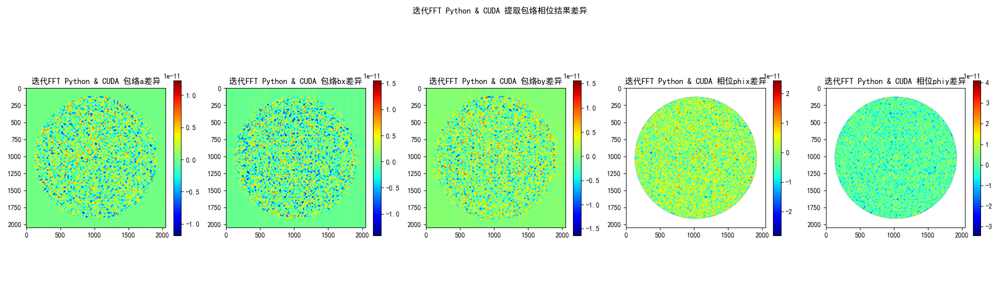
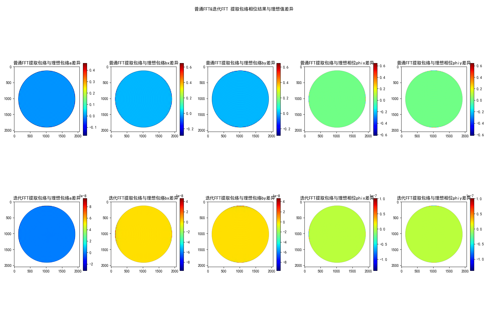
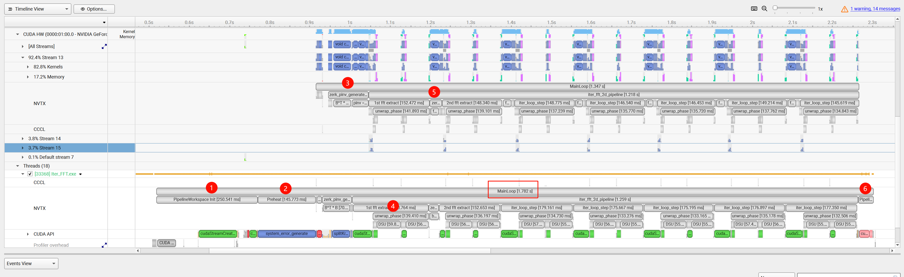
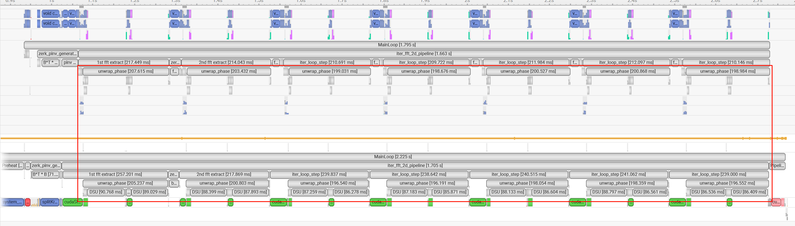
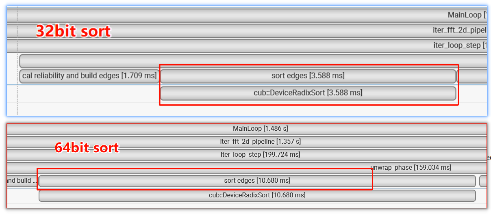
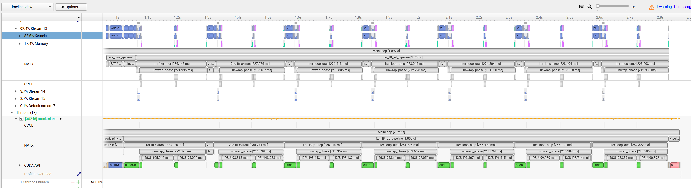

# Iter_FFT-cuda-accelerator

## 介绍
一个使用 CUDA 和 C++ 加速的迭代FFT提算法，用于提取二维条纹图像的相位。相比 Python numpy版本大约快20倍，比Python cupy版本快大约11.5倍。

## 环境:
```
Graphics Card: RTX 4070 Super

Python 3.11

CUDA Version 13.2

CUDAToolkit 12.8

g++(Ubuntu 13.3.0-6ubuntu2~24.04.1) 13.3.0
```

## quick start
我们提供了算法的 Python NumPy 版本和 CuPy 版本，你可以通过 config.py 中的 'CUPY' 参数在它们之间切换。

### Python
```
cd Iter_FFT_py
pip install -r requirements.txt
python iter_fft.py
```

### CUDA
这是个优化版本，相比于旧版本做了内存分配优化以及一些细节调优
```
cd Iter_FFT_opt_cu
mkdir -p build && cd build
cmake -DCMAKE_BUILD_TYPE=Release ..
make -j$(nproc)
./app
```

这是个旧版本
```
cd Iter_FFT_cu
mkdir -p build && cd build
cmake -DCMAKE_BUILD_TYPE=Release ..
make -j$(nproc)
./app
```

## result

- 输入


- Python 版本和 CUDA 版本的结果差异：


- 同时，使用迭代 FFT 算法和普通 FFT 算法提取的包络相位与理想包络相位的差异:



核心模块耗时对比：

| 核心耗时模块              | numpy    | cupy     | CUDA&C++   |
|---------------------|----------|----------|------------|
| zernike基生成 / s      | 2.1      | 0.08     | 0.01       |
| zernike基伪逆生成 / s    | 2        | 0.22     | 0.1        |
| FFT变换 / s           | 0.4 * 7  | 0.02 * 7 | 0.01 * 7   |
| zernike低通滤波 / s     | 1.25 * 6 | 0.08 * 6 | 0.02 * 6   |
| 相位解包裹 / s           | 1.4 * 14 | 1.4 * 14 | 0.068 * 14 |
| 其他(内存分配、释放、预热等) / s | 0.4      | 0.02     | 0.528      |
| 整体耗时 / s            | 34.4     | 20.54    | 1.78       |

PS：表中 a * b 中a表示的是单次耗时，b是执行次数 

这里注意到，相位展开的时间对于 numpy 和 cupy 来说是一样的，因为相位展开是一个高度串行的算法。
在 Python 中，它调用了第三方库 skimage.restoration.unwrap_phase，而这个库不支持 GPU 加速，所以cupy版本通过转numpy实现解包裹。
他是我们算法的核心耗时瓶颈，因为算法核心是一个高度串行化的路径寻优并查集算法

在 CUDA 版本中，一开始我们尝试了用一个单线程去实现，效果很差，运行完要几十s，后面尝试了一种基于有限差分的快速傅里叶变换与离散余弦变换相位解包裹算法，
虽然该算法使得运行时间得到了明显降低，但是算法会把某些误差分散到全局，使得整体相位求解精度不够。

后来我们阅读了 C 源码，识别到整个算法中除并查集外的部分如计算可靠性、排序、路径展开压缩和偏移量写回是适合做并行优化的，于是我们对这些模块进行了 CUDA 优化，
同时应用数据预取等手段优化数据访问，最终通过CPU+GPU混合解包裹流程将相位解包裹加速大约20倍

同时，代码整体选用double类型是因为项目追求高精度的相位结果，使用float后精度会下降几个数量级，当然，当前算法耗时的瓶颈并不在数据类型上

对于整个算法，我们的 CUDA 版本相比 numpy 版本快了将近 19 倍，相比 numpy 版本快了将近 11.5 倍，但是相位解包裹仍然是一个相对耗时的操作，
因为强数据依赖导致GPU资源没有得到充分利用，这需要进一步研究并行化相位解包裹的方案

## 优化点对性能提升
在这以当前节点项目版本(2026.9.13)对一些优化点的性能影响做benchmark记录。
下图是当前节点版本的Nsight System Profile结果图，从NVTX标记间隔时间范围可以看出当前算法的核心模块耗时，上半部分是GPU NVTX kernel统计时间，下半部分是CPU NVTX统计时间，
所以对于在主机端执行的模块我们看下半部分的耗时，设备端的看上半部分耗时。




| 核心模块             | 单次运行耗时 | 在整体算法过程中总耗时(叠加多次运行结果) |
|------------------|--------|-----------------------|
| 内存分配 / s         | 0.251  | 0.251                 |
| 预热 / s           | 0.146  | 0.146                 |
| zernike基伪逆生成 / s | 0.1    | 0.1                   |
| 相位解包裹 / s        | 0.068  | 0.952                 |
| zernike低通滤波 / s  | 0.02   | 0.12                  |
| 内存释放 / s         | 0.04   | 0.04                  |

- 可以看到将近50%的时间都在相位解包裹上，但是相比Python cupy版本95%的时间在相位解包裹上，我们已经做了很多优化，整个算法相对于cupy速度提升11.5倍。
从Nsight System可以看到当前耗时瓶颈依然是相位解包裹模块，不过相比于Python的1.4s，这里已经降到了大约75ms一次解包裹，同时也能看到相位解包裹主要耗时
依然在DSU部分，也就是并查集模块。

- 对于zernike基伪逆生成的100ms，我们显卡的理论FP64算力是550 GFLOPS，伪逆过程需要进行两次大矩阵运算M, N, K = 64, 64, 2516796，
所以每次运算理论浮点运行次数：

$$
2 * M * N * K = 2 * 64 * 64 * 2516796 = 20617592832 FLOPS
$$

理论耗时：

$$
\frac{20617592832 FLOPS}{500 GFLOPS / s} = 0.041s
$$

所以这两次矩阵运算就要80+ms，还有一些其他函数耗时20ms。

- 对于zernike低通滤波的20ms，按照上面的过程估算理论耗时，矩阵运算M, N, K = 64, 5, 2516796，
所以每次运算理论浮点运行次数：

$$
2 * M * N * K = 2 * 64 * 5 * 2516796 = 1610749440 FLOPS
$$

理论耗时：

$$
\frac{1610749440 FLOPS}{500 GFLOPS / s} = 0.003s
$$

所以理论上只需要3ms，现在20ms的原因是尚不清楚，猜测N=5这个维度太小了，导致硬件资源没得到充分利用，先在这Mark下。

### 相位解包裹添加MASK，只解包裹有效区域减小数据维度
原始算法是对整个2048*2048区域去做路径搜索，但其实我们只对相位有效部分区域感兴趣，所以可以对其添加一个mask，把未解包裹相位mask外区域置nan值，
在做并查集合并的时候跳过这些无效区域
```
phi[idx] = rho[idx] <= static_cast<T>(1.0) ? my_atan2(im, re) : NAN;

// 含 NaN 的无效边：标记为跳过
if (isnan(w1) || isnan(w2)) {
    compact_edges[e].u = -1;
    compact_edges[e].v = -1;
    compact_edges[e].k0 = 0;
    edge_keys[e] = 0xFFFFFFFFu;
    return;
}

int p1 = h_edges[e].u;
int p2 = h_edges[e].v;
if (p1 < 0 || p2 < 0) continue;  // 跳过无效边
```

这里给出不做mask处理的结果，从图中可以看出，不做mask处理的DSU模块平均耗时86ms，做mask处理的DSU模块平均耗时57ms。
也就是说开启mask处理对DSU性能提升了23%。


  
### RadixSort (32-bit Key)
算法在计算出像素的可靠性后会建立所有边的权重，计算方式是将边两侧的像素值求和作为权重，而由于边的数量在4M这个量级，我们可以将权重转为32bit加速
```
cub::DeviceRadixSort::SortPairs(
    ws.d_cub_temp_storage, temp_storage_bytes,
    d_keys_db, d_edges_db, E,
    0, 32, stream
);
```

这里给出按32bit和64bit的排序结果，从图中可以看出，32bit sort耗时3.6ms, 64bit sort耗时10.7ms，耗时降低66%，因为sort会做14次，这里相当于总耗时降了100ms。



### PREFETCH_READ
在并查集合并当前边数据的时候，在处理第e条边时异步发送读取第e+24条边的数据(实测时测试了4到120之间步进的值，24相对性能较佳)，这样可以掩盖数据读取的延迟，
```
#if defined(__GNUC__) || defined(__clang__)
#define PREFETCH_READ(addr) __builtin_prefetch((addr), 0, 1)
#elif defined(_MSC_VER)
#include <xmmintrin.h>
#define PREFETCH_READ(addr) _mm_prefetch((const char*)(addr), _MM_HINT_T0)
#else
#define PREFETCH_READ(addr)
#endif

// 提前预取第 e+24 条边对应的 DSU 节点，以掩盖内存延迟
PREFETCH_READ(&dsu_ptr[h_edges[std::min(e + 24, E - 1)].u]);
PREFETCH_READ(&dsu_ptr[h_edges[std::min(e + 24, E - 1)].v]);
```

这里给出不做预取处理的结果，从图中可以看出不做预取处理平均每次DSU耗时95ms，而基线结果平均耗时57ms，也就是这里预取降低了40%耗时


## 参考

- [NVIDIA Nsight Systems user guide](https://docs.nvidia.com/nsight-systems/UserGuide/index.html#)
- [The User Guide for Nsight Compute](https://docs.nvidia.com/nsight-compute/NsightCompute/index.html#)
- [CUDA Programming Guide](https://docs.nvidia.com/cuda/cuda-programming-guide/index.html)

## 下一步计划

- 考虑其他方式来并行化相位展开，或者可能使用分块展开，使用16*16的块分割图像，每个块做相位解包裹，之后块间偏移量做修正，类似并行规约的思想（不过这现在只是个想法）
- 重构项目结构